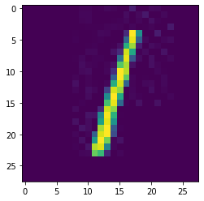

# MNIST

This tutorial is split into two parts:

1. Configuration
2. Running the server



This tutorial is tested on TensorFlow 2.0.0.



```java
import ai.konduit.serving.InferenceConfiguration;
import ai.konduit.serving.config.ParallelInferenceConfig;
import ai.konduit.serving.config.ServingConfig;
import ai.konduit.serving.configprovider.KonduitServingMain;
import ai.konduit.serving.configprovider.KonduitServingMainArgs;
import ai.konduit.serving.model.ModelConfig;
import ai.konduit.serving.model.ModelConfigType;
import ai.konduit.serving.model.TensorDataTypesConfig;
import ai.konduit.serving.model.TensorFlowConfig;
import ai.konduit.serving.pipeline.step.ImageLoadingStep;
import ai.konduit.serving.pipeline.step.ModelStep;
import ai.konduit.serving.verticles.inference.InferenceVerticle;
import com.mashape.unirest.http.Unirest;
import com.mashape.unirest.http.exceptions.UnirestException;
import org.apache.commons.io.FileUtils;
import org.datavec.api.writable.NDArrayWritable;
import org.datavec.api.writable.Writable;
import org.datavec.image.transform.ImageTransformProcess;
import org.nd4j.linalg.api.ndarray.INDArray;
import org.nd4j.linalg.io.ClassPathResource;
import org.nd4j.serde.binary.BinarySerde;
import org.nd4j.tensorflow.conversion.TensorDataType;
```

## Overview

Konduit Serving works by defining a series of **steps**. These include operations such as

1. Pre- or post-processing steps
2. One or more machine learning models
3. Transforming the output in a way that can be understood by humans

If deploying your model does not require pre- nor post-processing, only one step - a machine learning model - is required. This configuration is defined using a single `ModelStep`.

Set the model file path to `mnistmodelfilePath`.

```java
String tensorflow_version = "2.0.0";

String mnistmodelfilePath = new ClassPathResource("data/mnist/mnist_" + tensorflow_version + ".pb").getFile().getAbsolutePath();
```

 A reference Java project is provided in the Example repository ( <https://github.com/KonduitAI/konduit-serving-examples> ) with a Maven pom.xml dependencies file. If using the IntelliJ IDEA IDE, open the java folder as a Maven project and run the main function of the InferenceModelStepMNIST class. 

## Configure the step

### Define the TensorFlow configuration as a `TensorFlowConfig` object

- `tensorDataTypesConfig`: The `TensorFlowConfig` object requires a HashMap `input_data_types`. Its keys should represent column names, and the values should represent data types as strings, e.g. `"INT32"`,`"FLOAT"`,etc,. See [here](https://github.com/KonduitAI/konduit-serving/blob/master/konduit-serving-api/src/main/java/ai/konduit/serving/model/TensorDataType.java) for a list of supported data types.
- `modelConfigType`: This argument requires a `ModelConfigType` object. Specify `modelType` as `TENSORFLOW`, and `modelLoadingPath` to point to the location of TensorFlow weights saved in the PB file format.

```java
HashMap<String, TensorDataType> input_data_types = new HashMap();
input_data_types.put("input_layer", TensorDataType.FLOAT);

ModelConfig mnistModelConfig = TensorFlowConfig.builder()
    .tensorDataTypesConfig(TensorDataTypesConfig.builder().
            inputDataTypes(input_data_types).build())

    .modelConfigType(ModelConfigType.builder().
            modelLoadingPath(mnistmodelfilePath.toString()).
            modelType(ModelConfig.ModelType.TENSORFLOW).build())
    .build();
```

Now that we have a `TensorFlowConfig` defined, we can define a `ModelStep`. The following parameters are specified:

- `modelConfig`: pass the mnistModelConfig object here
- `parallelInferenceConfig`: specify the number of workers to run in parallel. Here, we specify `workers=1`.
- `inputNames`: names for the input data
- `outputNames`: names for the output data

```java
List<String> input_names = new ArrayList<String>(input_data_types.keySet());
ArrayList<String> output_names = new ArrayList<>();
output_names.add("output_layer/Softmax");

ModelStep mnistModelStep = ModelStep.builder()
    .modelConfig(mnistModelConfig)
    .inputNames(input_names)
    .outputNames(output_names)
    .parallelInferenceConfig(ParallelInferenceConfig.builder().workers(1).build())
    .build();
```

## Configure the server

Specify the following:

- `httpPort`: Specify any port number that is not reserved.

```java
int port = Util.randInt(1000, 65535);

ServingConfig servingConfig = ServingConfig.builder()
    .httpPort(port)
    .build();
```

The `ServingConfig` has to be passed to `Server` in addition to the steps as a list. In this case, there is a single step: `mnistModelStep`.

```java
InferenceConfiguration inferenceConfiguration = InferenceConfiguration.builder()
    .servingConfig(servingConfig)
    .step(mnistModelStep)
    .build();
```

The `inferenceConfiguration` is stored as a JSON File. Set the KonduitServingMainArgs with the saved **config.json** file path as `configPath` and other necessary server configuration arguments.

```java
File configFile = new File("config.json");
FileUtils.write(configFile, inferenceConfiguration.toJson(), Charset.defaultCharset());

//Set and Start inference server as per the above configurations
KonduitServingMainArgs args1 = KonduitServingMainArgs.builder()
    .configStoreType("file").ha(false)
    .multiThreaded(false).configPort(port)
    .verticleClassName(InferenceVerticle.class.getName())
    .configPath(configFile.getAbsolutePath())
    .build();
```

Start server by calling KonduitServingMain with the configurations mentioned in the KonduitServingMainArgs using Callback Function(as per the code mentioned in the **Inference** Section below)

## Inference

The image file(s) has to be converted into NDARRAY using `ImageLoadingStep` and passed as an input for inference.

```java
ImageTransformProcess imageTransformProcess = new ImageTransformProcess.Builder()
    .scaleImageTransform(20.0f)
    .resizeImageTransform(28, 28)
    .build();

ImageLoadingStep imageLoadingStep = ImageLoadingStep.builder()
    .imageProcessingInitialLayout("NCHW")
    .imageProcessingRequiredLayout("NHWC")
    .inputName("default")
    .dimensionsConfig("default", new Long[]{240L, 320L, 3L}) // Height, width, channels
    .imageTransformProcess("default", imageTransformProcess)
    .build();

ArrayList<INDArray> imageArr = new ArrayList<>();
ArrayList<String> inputString = new ArrayList<>();
inputString.add("data/facedetector/1.jpg");

for (String imagePathStr : inputString) {
    String tmpInput = new ClassPathResource(imagePathStr).getFile().getAbsolutePath();
    Writable[][] tmpOutput = imageLoadingStep.createRunner().transform(tmpInput);
    INDArray tmpImage = ((NDArrayWritable) tmpOutput[0][0]).get();
    imageArr.add(tmpImage);
}
```

To configure the client, set the required URL to connect server and specify any port number that is not reserved (as used in server configuration).

A Callback Function onSuccess is implemented in order to post the Client request and get the HttpResponse, only after the successful run of the KonduitServingMain Server.

 Accepted input and output data formats are as follows:

- Input: JSON, ARROW, IMAGE, ND4J and NUMPY.
- Output: NUMPY, JSON, ND4J and ARROW. 

Note that we consider only one test image in this example.

```java
KonduitServingMain.builder()
    .onSuccess(() -> {
        try {
            for (INDArray indArray : imageArr) {

                File file = new File("src/main/resources/data/test-input.zip");
                BinarySerde.writeArrayToDisk(indArray, file);

                String result = Unirest.post(String.format("http://localhost:%s/raw/nd4j", port))
                        .field("input_layer", file)
                        .asString().getBody();

                System.out.println(result);
                System.exit(0);
            }
        } catch (UnirestException | IOException e) {
            e.printStackTrace();
            System.exit(0);
        }
    })
    .build()
    .runMain(args1.toArgs());
```

## Confirm the output

After executing the above, in order to confirm the successful start of the Server, check for the below output text:

```text
Jan 07, 2020 2:31:37 PM ai.konduit.serving.configprovider.KonduitServingMain
INFO: Deployed verticle ai.konduit.serving.verticles.inference.InferenceVerticle
```

The Output of the program is as follows:

```java
System.out.println(result);
```



```text
{
  "output_layer/Softmax" : {
    "batchId" : "8d7acc0d-5497-4882-89db-2b3a0772e480",
    "ndArray" : {
      "dataType" : "FLOAT",
      "shape" : [ 3, 10 ],
      "data" : [ 0.0, 0.0, 1.0, 0.0, 0.0, 0.0, 0.0, 0.0, 0.0, 0.0, 0.0, 0.0, 1.0, 0.0, 0.0, 0.0, 0.0, 0.0, 0.0, 0.0, 0.0, 0.0, 1.0, 0.0, 0.0, 0.0, 0.0, 0.0, 0.0, 0.0 ]
    }
  }
}
```

The complete inference configuration in JSON format is as follows:

```java
System.out.println(inferenceConfiguration.toJson());
```

```text
{
  "memMapConfig" : null,
  "servingConfig" : {
    "httpPort" : 19947,
    "listenHost" : "localhost",
    "logTimings" : false,
    "metricTypes" : [ "CLASS_LOADER", "JVM_MEMORY", "JVM_GC", "PROCESSOR", "JVM_THREAD", "LOGGING_METRICS", "NATIVE" ],
    "outputDataFormat" : "JSON",
    "uploadsDirectory" : "file-uploads/"
  },
  "steps" : [ {
    "@type" : "ModelStep",
    "inputColumnNames" : { },
    "inputNames" : [ "input_layer" ],
    "inputSchemas" : { },
    "modelConfig" : {
      "@type" : "TensorFlowConfig",
      "configProtoPath" : null,
      "modelConfigType" : {
        "modelLoadingPath" : "C:\\konduit-serving-examples\\java\\target\\classes\\data\\mnist\\mnist_2.0.0.pb",
        "modelType" : "TENSORFLOW"
      },
      "savedModelConfig" : null,
      "tensorDataTypesConfig" : {
        "inputDataTypes" : {
          "input_layer" : "FLOAT"
        },
        "outputDataTypes" : { }
      }
    },
    "normalizationConfig" : null,
    "outputColumnNames" : { },
    "outputNames" : [ "output_layer/Softmax" ],
    "outputSchemas" : { },
    "parallelInferenceConfig" : {
      "batchLimit" : 32,
      "inferenceMode" : "BATCHED",
      "maxTrainEpochs" : 1,
      "queueLimit" : 64,
      "vertxConfigJson" : null,
      "workers" : 1
    }
  } ]
}
```
