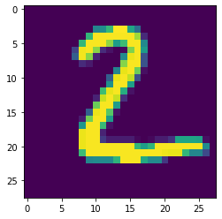
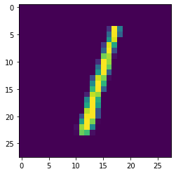

# MNIST

This tutorial is split into three parts:

1. Freezing models 
2. Configuration 
3. Running the server


This tutorial is tested on TensorFlow 1.14, 1.15 and 2.00.


```python
from konduit import ParallelInferenceConfig, ServingConfig, ModelConfigType, TensorFlowConfig
from konduit import TensorDataTypesConfig, ModelStep, InferenceConfiguration
from konduit.server import Server
from konduit.client import Client

import tensorflow as tf

if tf.__version__[0] == "1":     
    from tensorflow import keras
elif tf.__version__[0] == "2": 
    import tensorflow.compat.v1 as tf
    from tensorflow.compat.v1 import keras
else: 
    print("No valid TensorFlow version detected")

from keras.layers import Flatten, Dense, Dropout, Lambda
from keras.models import Sequential
from keras.datasets import mnist

from PIL import Image
import numpy as np
import imageio
import os
import matplotlib.pyplot as plt 
import pandas as pd
```

```text
Using TensorFlow backend.
```

```python
tensorflow_version = tf.__version__
print(tensorflow_version)
```

```text
2.0.0
```

## Creating frozen models \(Tensorflow 1.x\)

In TensorFlow 1.x, "frozen" models can be exported in the TensorFlow Graph format. For deployment, we only need information on the graph and checkpoint variables. Freezing a model allows you to discard information that is not required for deploying your model.


TensorFlow 2.0 introduces the [SavedModel format](https://www.tensorflow.org/guide/saved_model) as the universal format for saving models. Even though the deployable protobuff \(PB\) files have the same file extension as frozen TensorFlow Graph files, SavedModel protobuff files are not currently supported in Konduit Serving. A workaround for TensorFlow 2.0 is to adapt the code from this tutorial for your use case to create TensorFlow Graph protobuffs.


The following code is adapted from `tf-import-examples` in the [`deeplearning4j-examples`](https://github.com/eclipse/deeplearning4j-examples/) repository.

In the following code, we build a model using TensorFlow's Keras API and save it as a TensorFlow Graph. The architecture is adapted from the following Kaggle kernel: [https://inclass.kaggle.com/charel/learn-by-example-neural-networks-hello-world/notebook](https://inclass.kaggle.com/charel/learn-by-example-neural-networks-hello-world/notebook).

```python
# Load data
train_data, test_data = mnist.load_data()
x_train, y_train = train_data
x_test, y_test = test_data

# Normalize
x_train = x_train / 255.0
x_test  = x_test / 255.0

weights = None

def get_model(training=False): 
    inputs = keras.layers.Input(shape=(28, 28), name="input_layer")
    x = keras.layers.Flatten()(inputs)
    x = keras.layers.Dense(200, activation="relu")(x)
    x = keras.layers.Dense(100, activation="relu")(x)
    x = keras.layers.Dense(60, activation="relu")(x)
    x = keras.layers.Dense(30, activation="relu")(x)
    outputs = keras.layers.Dense(10, activation="softmax", name="output_layer")(x)
    model = tf.keras.Model(inputs=inputs, outputs=outputs)
    model.compile(
        optimizer='sgd', 
        loss='sparse_categorical_crossentropy', 
        metrics=['accuracy']
    )

    if training: 
        print(model.inputs[0].op.name)
        print(model.outputs[0].op.name)

    return model


def train():
    with tf.Session() as sess:
        keras.backend.set_session(sess)
        model = get_model(True)
        model.fit(x_train, y_train, epochs=8)
        weights = model.get_weights()
    return weights

def save(weights):
    # save model to a protobuff
    keras.backend.clear_session()
    with tf.Session() as sess:
        keras.backend.set_session(sess)
        model = get_model(False)
        model.set_weights(weights)
        model.evaluate(x_test, y_test)
        output_node_name = model.output.name.split(':')[0]
        output_graph_def = tf.graph_util.convert_variables_to_constants(
            sess, 
            sess.graph.as_graph_def(), 
            [output_node_name]
        )

        with tf.gfile.GFile(
            name=f"../data/mnist/mnist_{tensorflow_version}.pb", 
            mode="wb"
        ) as f:
            f.write(output_graph_def.SerializeToString())

weights = train()
save(weights)
```

```text
WARNING:tensorflow:From C:\Users\Skymind AI Berhad\AppData\Local\Continuum\miniconda3\lib\site-packages\tensorflow_core\python\ops\resource_variable_ops.py:1630: calling BaseResourceVariable.__init__ (from tensorflow.python.ops.resource_variable_ops) with constraint is deprecated and will be removed in a future version.
Instructions for updating:
If using Keras pass *_constraint arguments to layers.
input_layer
output_layer/Softmax
Train on 60000 samples
Epoch 1/8
60000/60000 [==============================] - 3s 53us/sample - loss: 0.6992 - accuracy: 0.7869
Epoch 2/8
60000/60000 [==============================] - 3s 52us/sample - loss: 0.2445 - accuracy: 0.9294
Epoch 3/8
60000/60000 [==============================] - 3s 50us/sample - loss: 0.1782 - accuracy: 0.9481
Epoch 4/8
60000/60000 [==============================] - 3s 52us/sample - loss: 0.1425 - accuracy: 0.9588s
Epoch 5/8
60000/60000 [==============================] - 3s 51us/sample - loss: 0.1180 - accuracy: 0.9651
Epoch 6/8
60000/60000 [==============================] - 3s 49us/sample - loss: 0.1020 - accuracy: 0.9699s - l
Epoch 7/8
60000/60000 [==============================] - 3s 48us/sample - loss: 0.0882 - accuracy: 0.9741
Epoch 8/8
60000/60000 [==============================] - 3s 47us/sample - loss: 0.0778 - accuracy: 0.9771
10000/10000 [==============================] - 0s 31us/sample - loss: 0.1160 - accuracy: 0.9640
WARNING:tensorflow:From <ipython-input-3-3e44ee2b8acb>:54: convert_variables_to_constants (from tensorflow.python.framework.graph_util_impl) is deprecated and will be removed in a future version.
Instructions for updating:
Use `tf.compat.v1.graph_util.convert_variables_to_constants`
WARNING:tensorflow:From C:\Users\Skymind AI Berhad\AppData\Local\Continuum\miniconda3\lib\site-packages\tensorflow_core\python\framework\graph_util_impl.py:275: extract_sub_graph (from tensorflow.python.framework.graph_util_impl) is deprecated and will be removed in a future version.
Instructions for updating:
Use `tf.compat.v1.graph_util.extract_sub_graph`
INFO:tensorflow:Froze 10 variables.
INFO:tensorflow:Converted 10 variables to const ops.
```

## Overview

Konduit Serving works by defining a series of **steps**. These include operations such as 

1. Pre- or post-processing steps 
2. One or more machine learning models 
3. Transforming the output in a way that can be understood by humans

If deploying your model does not require pre- nor post-processing, only one step - a machine learning model - is required. This configuration is defined using a single `ModelStep`.

Before running this notebook, run the `build_jar.py` script and copy the JAR \(`konduit.jar`\) to this folder. Refer to the [Python SDK README](https://github.com/KonduitAI/konduit-serving/blob/master/python/README.md) for details.

## Configure the step



Define the TensorFlow configuration as a `TensorFlowConfig` object.

* `tensor_data_types_config`: The `TensorFlowConfig` object requires a dictionary `input_data_types`. Its keys should represent column names, and the values should represent data types as strings, e.g. `"INT32"`. See [here](https://github.com/KonduitAI/konduit-serving/blob/master/konduit-serving-api/src/main/java/ai/konduit/serving/model/TensorDataType.java) for a list of supported data types. 
* `model_config_type`: This argument requires a `ModelConfigType` object. Specify `model_type` as `TENSORFLOW`, and `model_loading_path` to point to the location of TensorFlow weights saved in the PB file format.

```python
tensorflow_config = TensorFlowConfig(
    tensor_data_types_config = TensorDataTypesConfig(
        input_data_types=input_data_types
        ),
    model_config_type = ModelConfigType(
        model_type='TENSORFLOW',
        model_loading_path=os.path.abspath(
            f'../data/mnist/mnist_{tensorflow_version}.pb'
        )
    )
)
```

```python
tensorflow_config.as_dict()
```

```text
{'@type': 'TensorFlowConfig',
 'tensorDataTypesConfig': {'@type': 'TensorDataTypesConfig',
  'inputDataTypes': {'input_layer': 'FLOAT'}},
 'modelConfigType': {'@type': 'ModelConfigType',
  'modelType': 'TENSORFLOW',
  'modelLoadingPath': 'C:\\Users\\Skymind AI Berhad\\Documents\\konduit-serving-examples\\data\\mnist\\mnist_2.0.0.pb'}}
```

Now that we have a `TensorFlowConfig` defined, we can define a `ModelStep`. The following parameters are specified:

* `model_config`: pass the TensorFlowConfig object here 
* `parallel_inference_config`: specify the number of workers to run in parallel. Here, we specify `workers=1`.
* `input_names`:  names for the input data  
* `output_names`: names for the output data

```python
tf_step = ModelStep(
    model_config=tensorflow_config,
    parallel_inference_config=ParallelInferenceConfig(workers=1),
    input_names=input_names,
    output_names=output_names
)
```



In the YAML configuration file, we define a single `tensorflow_step` with

* `type`: TENSORFLOW
* `model_loading_path` pointing to the location of the weights 
* `input_names` and `output_names`: names of the input and output nodes. Define this as a list. 
* `input_data_types`: maps each of the inputs to a corresponding data type. Values should represent data types as strings, e.g. `"INT32"`. See [here](https://github.com/KonduitAI/konduit-serving/blob/master/konduit-serving-api/src/main/java/ai/konduit/serving/model/TensorDataType.java) for a list of supported data types. 

```yaml
steps:
  tensorflow_step:
    type: TENSORFLOW
    model_loading_path: ../data/mnist/mnist_2.0.0.pb
    input_names:
      - input_layer
    output_names:
      - output_layer/Softmax
    input_data_types:
      input_layer: FLOAT
    parallel_inference_config:
      workers: 1
```




Konduit Serving requires input and output names to be specified. In TensorFlow, you can find the names of your input and output nodes by printing `model.inputs[0].op.name` and `model.outputs[0].op.name` respectively. For more details, please refer to this [StackOverflow answer](https://stackoverflow.com/a/49154874/12260518).

```python
# make note of hwo to obtain input_name and output_name
input_data_types = {'input_layer': 'FLOAT'}
input_names = list(input_data_types.keys())
output_names = ["output_layer/Softmax"]
```


## Configure the server



Specify the following:

* `http_port`: select a random port.
* `input_data_format`, `output_data_format`: Specify input and output data formats as strings. 

```python
port = np.random.randint(1000, 65535)
serving_config = ServingConfig(
    http_port=port,
    input_data_format='NUMPY',
    output_data_format='NUMPY'
)
```

The `ServingConfig` has to be passed to `Server` in addition to the steps as a Python list. In this case, there is a single step: `tf_step`.

```python
server = Server(
    serving_config=serving_config,
    steps=[tf_step]
)
```

By default, `Server()` looks for the Konduit Serving JAR `konduit.jar` in the directory the script is run in. To change this default, use the `jar_path` argument.



The following parameters should be specified to `serving`: 

* `http_port`: specify an integer as port number 
* `input_data_format`, `output_data_format`: Input and output data formats

```yaml
serving:
  http_port: 1337
  input_data_format: NUMPY
  output_data_format: NUMPY
```




Accepted input and output data formats are as follows:

* Input: JSON, ARROW, IMAGE, ND4J \(not yet implemented\) and NUMPY.
* Output: NUMPY, JSON, ND4J \(not yet implemented\) and ARROW.


## Start the server



Start the server:

```python
server.start()
```

```text
Starting server.....

Server has started successfully.


<subprocess.Popen at 0x1d6794ffd68>
```



```python
konduit_yaml_path = "../yaml/tensorflow-mnist.yaml"
server = server_from_file(konduit_yaml_path)
client = client_from_file(konduit_yaml_path)
```



## Configure the client



To configure the client, create a Client object with the following arguments:

* `input_data_format`: data format passed to the server for inference
* `output_data_format`: data format returned by the server endpoint 
* `return_output_data_format`: data format to be returned to the client. Note that this argument can be used to convert the output returned from the server to the client into a different format, e.g. NUMPY to JSON.

```python
client = Client(
    input_data_format='NUMPY',
    output_data_format='NUMPY',
    return_output_data_format="NUMPY",
    port=port
)
```



```yaml
client:
    port: 1337
```



## Inference 

We obtain test images from the test set defined by `keras.datasets`.

```python
for img in x_test[0:3]: 
    plt.imshow(img)
    predicted = client.predict(
        data_input={'input_layer': np.expand_dims(img.reshape(28, 28), axis=0)}
    )
    plt.show()
    print(dict(zip(np.arange(10), predicted[0].round(3))))
```


```text
{0: 0.0, 1: 0.0, 2: 0.001, 3: 0.001, 4: 0.0, 5: 0.0, 6: 0.0, 7: 0.998, 8: 0.0, 9: 0.0}
```



```text
{0: 0.0, 1: 0.0, 2: 0.998, 3: 0.002, 4: 0.0, 5: 0.0, 6: 0.0, 7: 0.0, 8: 0.0, 9: 0.0}
```



```text
{0: 0.0, 1: 0.986, 2: 0.005, 3: 0.0, 4: 0.0, 5: 0.0, 6: 0.0, 7: 0.005, 8: 0.003, 9: 0.0}
```

### Batch prediction

To predict in batches, the `data_input` dictionary has to be specified differently for client images in NDARRAY format. To input a batch of observations, ensure that your inputs are in the NCHW format: number of observations, channels \(optional if single channel\), height and width. An example is as follows:

```python
predicted = client.predict(
    data_input={'input_layer': x_test[0:3].reshape(3, 28, 28)}
)

server.stop()
```

We compare the predicted probabilities and the corresponding labels:

```python
pd.DataFrame(predicted).round(3)
```

|  | 0 | 1 | 2 | 3 | 4 | 5 | 6 | 7 | 8 | 9 |
| :--- | :--- | :--- | :--- | :--- | :--- | :--- | :--- | :--- | :--- | :--- |
| 0 | 0.0 | 0.000 | 0.001 | 0.001 | 0.0 | 0.0 | 0.0 | 0.998 | 0.000 | 0.0 |
| 1 | 0.0 | 0.000 | 0.998 | 0.002 | 0.0 | 0.0 | 0.0 | 0.000 | 0.000 | 0.0 |
| 2 | 0.0 | 0.986 | 0.005 | 0.000 | 0.0 | 0.0 | 0.0 | 0.005 | 0.003 | 0.0 |

```python
y_test[0:3]
```

```text
array([7, 2, 1], dtype=uint8)
```


The configuration is stored as a dictionary. Note that the configuration can be converted to a dictionary using the `as_dict()` method:

```python
server.config.as_dict()
```

```text
{'@type': 'InferenceConfiguration',
 'steps': [{'@type': 'ModelStep',
   'inputNames': ['input_layer'],
   'outputNames': ['output_layer/Softmax'],
   'modelConfig': {'@type': 'TensorFlowConfig',
    'tensorDataTypesConfig': {'@type': 'TensorDataTypesConfig',
     'inputDataTypes': {'input_layer': 'FLOAT'}},
    'modelConfigType': {'@type': 'ModelConfigType',
     'modelType': 'TENSORFLOW',
     'modelLoadingPath': 'C:\\Users\\Skymind AI Berhad\\Documents\\konduit-serving-examples\\data\\mnist\\mnist_2.0.0.pb'}},
   'parallelInferenceConfig': {'@type': 'ParallelInferenceConfig',
    'workers': 1}}],
 'servingConfig': {'@type': 'ServingConfig',
  'httpPort': 4776,
  'inputDataFormat': 'NUMPY',
  'outputDataFormat': 'NUMPY',
  'logTimings': True}}
```


