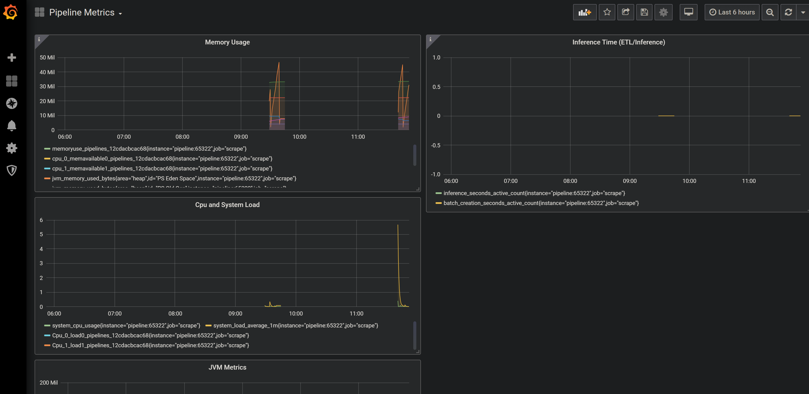

# Quickstart

## Prometheus

Prometheus is a widely used time series database for tracking system metrics used for debugging production systems. This includes common metrics used to troubleshoot an problems with production applications such as:

* Out of memory
* Latency

For machine learning, we may include other metrics to help debug things such as:

* Compute time for a neural net
* ETL creation \(number of times it takes to convert raw data to a minibatch or NumPy ndarray\)

Prometheus works by pulling data from the specified sources. A Prometheus instance is configured by a YAML file such as:

```yaml
# Global configurations
global:
  scrape_interval:     5s # Set the scrape interval to every 5 seconds.
  evaluation_interval: 5s # Evaluate rules every 5 seconds.
scrape_configs:
  - job_name: 'scrape'
    static_configs:
    - targets: [ 'localhost:1337']
```

This YAML file contains a global configuration and a [`scrap_config`](https://prometheus.io/docs/prometheus/latest/configuration/configuration/#scrape_config) section. See [Prometheus's configuration documentation](https://prometheus.io/docs/prometheus/latest/configuration/configuration/#scrape_config) for details.

The main component to configure is `targets`. `targets` is where you specify the source to pull data from. A Konduit Serving instance exposes metrics to be picked up by Prometheus from `http://<hostname>:<port>/metrics`.

## Grafana

[Grafana](https://grafana.com) is a dashboard system for pulling data from different sources and displaying it in real time. It can be used to visualize output from Prometheus.

Grafana allows you to declare a dashboard as a JSON file. An imported Grafana dashboard will show some pre-configured metrics. You can always extend/add more metrics in the Grafana GUI and re-export the configuration.

## Installation

* **Konduit Serving**: Follow the installation steps available at [https://serving.oss.konduit.ai/installation](https://serving.oss.konduit.ai/installation) to build a Konduit Serving JAR file and install the `konduit` Python module.
* **Prometheus**: Download a [precompiled Prometheus binary](https://prometheus.io/download) for your OS architecture and unzip to a location on your local drive. 
* **Grafana**: Install Grafana from Grafana's [Downloads](https://grafana.com/grafana/download) page. See the [Grafana installation documentation](https://grafana.com/docs/grafana/latest/installation/) for platform-specific instructions. 

## Usage

### Start Konduit server

In this folder, run the following in a command line

```bash
konduit serve --config ../../yaml/simple.yaml
```

This creates a local Konduit Serving instance using the YAML configuration file [simple.yaml](../yaml/simple.yaml) at port 1337.

### Start Prometheus server

In this example, we use Prometheus to monitor the Konduit Serving instance.

Copy the `prometheus.yml` file in this directory to the location of your Prometheus binary. Then, run:

```bash
./prometheus --config.file=prometheus_quickstart.yml
```

Omit the `./` if you're running Prometheus on `cmd.exe`. The `./` suffix is required on PowerShell.

By default, Prometheus runs on port 9090.

### Start Grafana server

In this example, we use Grafana, which provides a dashboard to visualize data from the Prometheus instance.

See the relevant Grafana installation instructions for your platform for instructions to start a Grafana service or, optionally, have Grafana initialize on startup. If you use the Windows installer to install Grafana, [NSSM](https://nssm.cc/) will run Grafana automatically at startup, and there is no need to initialize the Grafana server instance.

In your browser, open`localhost:3000`. Login with the username `admin` and password `admin`.

Next, add a Prometheus data source. Click on Add Data Source &gt; Prometheus, then insert the HTTP URL [http://localhost:9090](http://localhost:9090) in the following page.

On the bar on the left, mouse over on the + button, then click on Import.


Copy and paste the JSON in [dashboard.json](quickstart/dashboard.json) into the import page as follows, then click the Load button:


On the next page, enter a name for your dashboard \(such as **Pipeline Metrics**\). Click the Import button:


Your Grafana dashboard will render on the next page. This dashboard contains metrics for system load and memory as well as timings for performing inference and ETL.



### Obtaining a prediction

Use the `predict-numpy` command:

```bash
konduit predict-numpy --config ../../yaml/simple.yaml --numpy_data ../../data/simple/input_arr.npy
```

### Stop server

Remember to stop the Konduit Serving instance with

```bash
konduit stop-server --config ../../yaml/simple.yaml
```

## References

* Grafana support for Prometheus:  [https://prometheus.io/docs/visualization/grafana/](https://prometheus.io/docs/visualization/grafana/)

