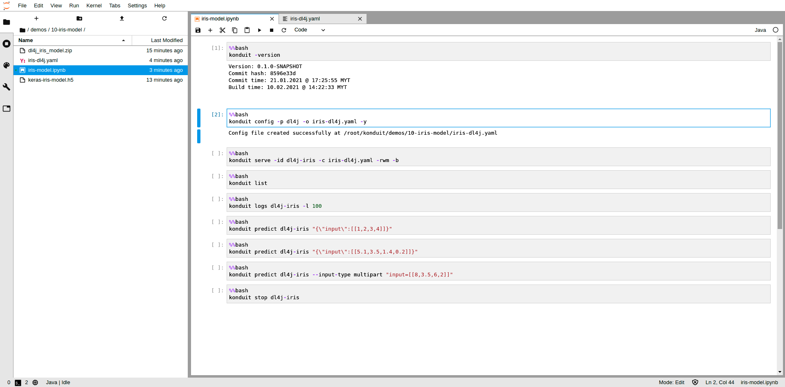
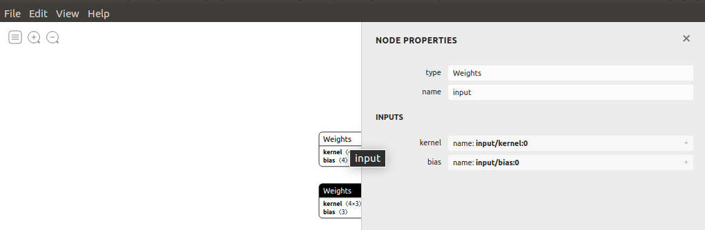
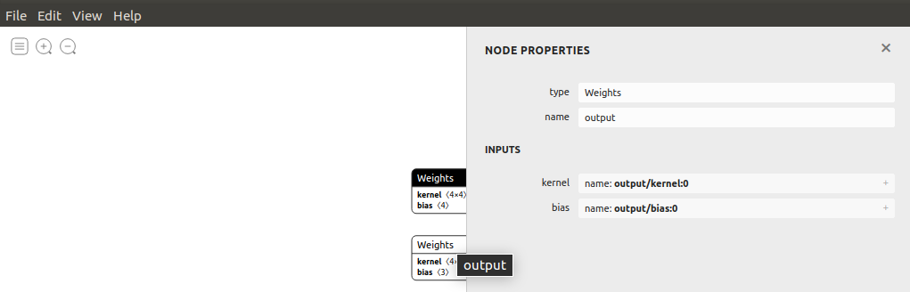
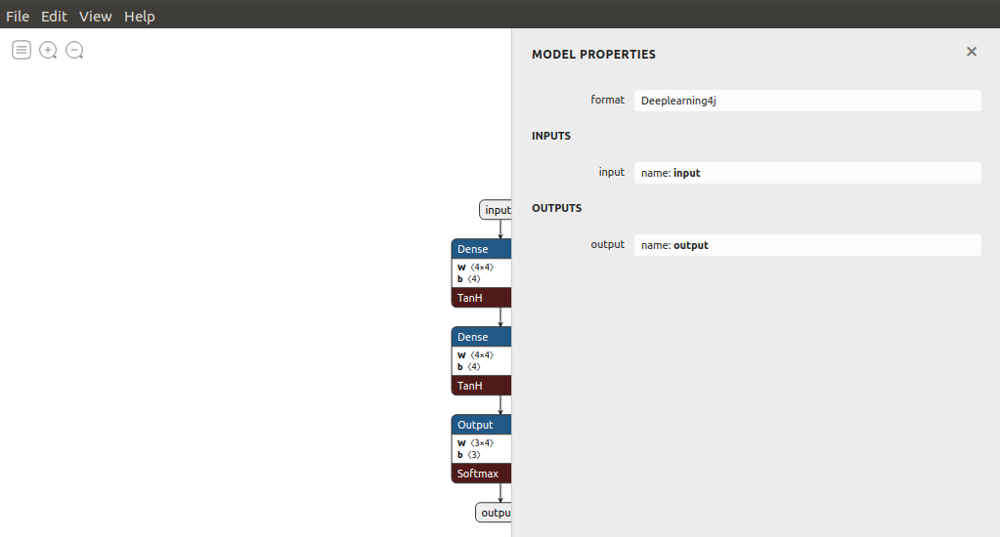
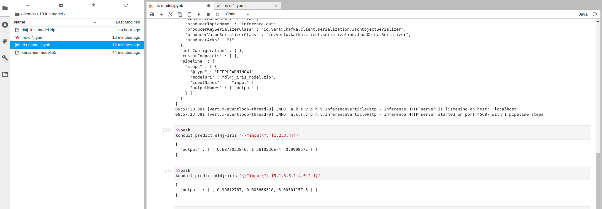
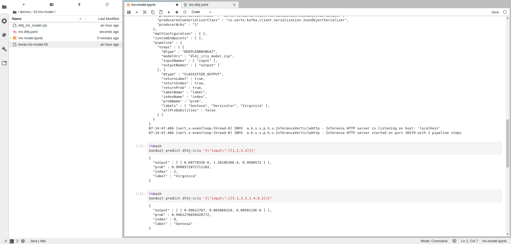

# Using Docker

In this section, we provide guidance on how to demonstrate Konduit-Serving with Docker. Konduit-Serving is a platform to serve the ML/DL models directly through a single line of code. We'll start building and installing the Konduit-Serving from docker image and follow by deploying the trained model in Konduit-Serving.

### Prerequisites

You will need following prerequisites to follow along

* [Docker 19.03.14](https://docs.docker.com/) 
* [Docker-Compose 1.27.4](https://docs.docker.com/compose/install/)

To ensure Konduit-Serving works properly, install these prerequisites. We’ll be using Konduit-Serving to deploy machine/deep learning pipelines easier using a few lines of code. We've prepared a Github repository to simplify showcasing Konduit-Serving.

### Introduction to Repository

The repository contains simple examples of deploying a pipeline using different model types. To clone the repository, run the following command:

```bash
git clone https://github.com/ShamsUlAzeem/konduit-serving-demo
```

Build the CPU version of docker image by running the following command in the root directory:

```bash
bash build.sh CPU
```

After a successful build, run docker image with docker-compose at current working directory:

```text
docker-compose up
```

Now, open [JupyterLab](http://localhost:8889/) in the browser.

### Explore Konduit-Serving in Repository

Let's take a look inside the [demos](https://github.com/ShamsUlAzeem/konduit-serving-demo/tree/master/demos) directory from [konduit-serving-demo](https://github.com/ShamsUlAzeem/konduit-serving-demo). Each folder inside the demos folder demonstrate serving a different kind of model, using a configuration file in either JSON or YAML, through the Konduit-Serving CLI.

The examples use different frameworks, including Keras, Tensorflow, Pytorch, and DL4J. These examples can be run in IPython Notebook \(.ipynb\) with Java-based kernel. Konduit-Serving provides a platform for users to take advantage of models using `konduit` CLI such as `serve`, `list`, `logs`, `predict` and `stop`. You can also build your model and start using Konduit-Serving.

Let's look at training and serving a model with Konduit-Serving.

### Build your model

These are steps to train a model for Keras and DL4J from scratch:



* First, import library that will be use:

```python
import keras
from keras.models import Sequential
from keras.layers import Dense
from keras.optimizers import Adam
from sklearn.preprocessing import LabelEncoder
from sklearn.model_selection import train_test_split
from sklearn.metrics import confusion_matrix
import seaborn as sns
import pandas as pd
import numpy as np
```

* Load Iris data set:

```python
dataset = sns.load_dataset("iris")
print(dataset)
```

* Display distribution of data set:

```python
sns.set(style="ticks")
sns.set_palette("husl")
sns.pairplot(dataset.iloc[:,0:6], hue="species")
```

* Apply data pre-processing and split data into training and testing:

```python
X = dataset.iloc[:,0:4].values
y = dataset.iloc[:,4].values

encoder =  LabelEncoder()
y1 = encoder.fit_transform(y)
Y = pd.get_dummies(y1).values

X_train,X_test, y_train,y_test = train_test_split(X,Y,test_size=0.3,random_state=0)
```

* Configure the model and print summary:

```python
model = Sequential()
model.add(Dense(4,input_shape=(4,),activation='relu', name="input"))
model.add(Dense(3,activation='softmax', name='output'))
model.compile(Adam(lr=0.01),'categorical_crossentropy',metrics=['accuracy'])
model.summary()
```

* Train the model by training data with 800 epochs:

```python
model.fit(X_train,y_train,epochs=800)
```

* Test the model by predicting testing data:

```python
y_pred = model.predict(X_test)
y_test_class = np.argmax(y_test,axis=1)
y_pred_class = np.argmax(y_pred,axis=1)
```

* Display confusion matrix to see more details of model prediction between actual and predicted result \(if satisfied can save the model\):

```python
cm = confusion_matrix(y_test_class, y_pred_class)
print(cm)
```

* Also, you can try to predict by using your value in the trained model:

```python
X_test2 = np.array([[5, 3.9, 2, 0.5],[5,2.5,3,1],[8,3.5,6,2]])#setosa, versicolor, virginica
y_pred2 = model.predict(X_test2)
print(y_pred2)
```

* Print the result of classification:

```python
print(np.argmax(y_pred2,axis=1)) #0 = setosa 1 = versicolor 2 = virginica
```

* Then, save the trained model in HDF5 \(.h5\) format which will be used in Konduit-Serving later:

```python
model.save_weights("model.h5")
print("Saved model to disk")
```

**The model is now ready to be deployed.**



* First, import library that will be use \(auto generated if you are using IntelliJ - proceed to next step\) :

```java
import org.datavec.api.records.reader.RecordReader;
import org.datavec.api.records.reader.impl.csv.CSVRecordReader;
import org.datavec.api.split.FileSplit;
import org.deeplearning4j.api.storage.StatsStorage;
import org.deeplearning4j.datasets.datavec.RecordReaderDataSetIterator;
import org.deeplearning4j.nn.conf.BackpropType;
import org.deeplearning4j.nn.conf.MultiLayerConfiguration;
import org.deeplearning4j.nn.conf.NeuralNetConfiguration;
import org.deeplearning4j.nn.conf.layers.DenseLayer;
import org.deeplearning4j.nn.conf.layers.OutputLayer;
import org.deeplearning4j.nn.multilayer.MultiLayerNetwork;
import org.deeplearning4j.nn.weights.WeightInit;
import org.deeplearning4j.ui.api.UIServer;
import org.deeplearning4j.ui.stats.StatsListener;
import org.deeplearning4j.ui.storage.InMemoryStatsStorage;
import org.deeplearning4j.util.ModelSerializer;
import org.nd4j.evaluation.classification.Evaluation;
import org.nd4j.linalg.activations.Activation;
import org.nd4j.linalg.dataset.DataSet;
import org.nd4j.linalg.dataset.SplitTestAndTrain;
import org.nd4j.linalg.dataset.api.iterator.DataSetIterator;
import org.nd4j.linalg.dataset.api.preprocessor.DataNormalization;
import org.nd4j.linalg.dataset.api.preprocessor.NormalizerStandardize;
import org.nd4j.linalg.io.ClassPathResource;
import org.nd4j.linalg.learning.config.Nesterovs;
import org.nd4j.linalg.lossfunctions.LossFunctions;

import java.io.File;
import java.util.Arrays;
```

* Declare the variables that will be used in the training process \(this code starts under main body\):

```java
int numLinesToSkip = 0;
char delimiter = ',';

int batchSize = 150; // Iris data set: 150 examples total. We are loading all of them into one DataSet (not recommended for large data sets)
int labelIndex = 4; // index of label/class column
int numClasses = 3;

int seed = 1234;
int epochs = 800;
double learningRate = 0.1;
int nHidden = 4;
```

* Load Iris data set from resources file:

```java
File inputFile = new ClassPathResource("datavec/iris.txt").getFile();
FileSplit fileSplit = new FileSplit(inputFile);
```

* Get data set using record reader \(to handle loading or parsing\):

```java
RecordReader recordReader = new CSVRecordReader(numLinesToSkip, delimiter);
recordReader.initialize(fileSplit);
```

* Create iterator from record reader:

```java
DataSetIterator iterator = new RecordReaderDataSetIterator(recordReader, batchSize, labelIndex, numClasses);
DataSet allData = iterator.next();
```

* Shuffling the arrangement of data and splitting into training and testing:

```java
allData.shuffle(seed);
SplitTestAndTrain testAndTrain = allData.splitTestAndTrain(0.7);
DataSet trainingData = testAndTrain.getTrain();
DataSet testData = testAndTrain.getTest();
```

* Apply data pre-processing by normalization:

```java
DataNormalization normalizer = new NormalizerStandardize();
normalizer.fit(trainingData);
normalizer.transform(trainingData);
normalizer.transform(testData);
```

* Configure and initiate the model that will be used:

```java
MultiLayerConfiguration config = new NeuralNetConfiguration.Builder()
       .seed(seed)
       .weightInit(WeightInit.XAVIER)
       .activation(Activation.TANH)
       .updater(new Nesterovs(learningRate, Nesterovs.DEFAULT_NESTEROV_MOMENTUM))
       .l2(1e-4)
       .list()
       .layer(0, new DenseLayer.Builder()
               .nIn(labelIndex)
               .nOut(nHidden)
               .build())
       .layer(1, new DenseLayer.Builder()
               .nOut(nHidden)
               .build())
       .layer(2, new OutputLayer.Builder(LossFunctions.LossFunction.MCXENT)
               .activation(Activation.SOFTMAX)
               .nOut(numClasses)
               .name("output")
               .build())
       .backpropType(BackpropType.Standard)
       .build();

MultiLayerNetwork model = new MultiLayerNetwork(config);
model.init();
```

* Display in UI of training process which can be seen when open in browser \(optional\):

```java
StatsStorage storage = new InMemoryStatsStorage();
UIServer server = UIServer.getInstance();
server.attach(storage);
model.setListeners(new StatsListener(storage, 10));
```

* Train the model using training data:

```java
for (int i=0; i < epochs; i++) {
   model.fit(trainingData);
}
```

* Evaluate the model by using testing data \(save the model if satisfied\):

```java
Evaluation eval = new Evaluation(3);
eval.eval(model.output(testData.getFeatures()),testData.getLabels());
System.out.println(eval.stats());
```

* Then, save the model at the location you want to keep with the name in Zip format. The model is ready to be used \(for example, the model saved in the current working directory\):

```java
File locationToSave = new File("./dl4j_iris_model.zip");
boolean saveUpdater = true;
ModelSerializer.writeModel(model,locationToSave,saveUpdater);
System.out.println("******PROGRAM IS FINISHED******");
```

**The model is now ready to be deployed.**



### Deploy your model in Konduit-Serving

Now, you are ready to deploy a model in Konduit-Serving by using `konduit` CLI. This step needs a saved model file \(h5 or zip file\) and JSON/YAML configuration file. Let's begin with:

* Create a new folder in the demos directory \(for example, 10-iris-model\):



* Drag the model file into the demos directory folder and create an IPython Notebook file with Java kernel \(for example, iris-model.ipynb\). 

In this notebook, we will use `konduit` CLI.

* Check the version of Konduit-Serving, and either is installed or not:

```text
%%bash
konduit -version
```

* Create the JSON/YAML configuration file by using `konduit config` command:



YAML configuration:

```bash
%%bash
konduit config -p keras -o iris-keras.yaml -y
```

Or, you can try this command to get a JSON configuration file:

```text
%%bash
konduit config -p keras -o iris-keras.json
```



YAML configuration:

```text
%%bash
konduit config -p dl4j -o iris-dl4j.yaml -y
```

Or, you can try this command to get a JSON configuration file:

```text
%%bash
konduit config -p dl4j -o iris-dl4j.json
```



* In the configuration file, you need to edit the YAML/JSON file in the pipeline section \(for this example, we will use YAML with DL4J\):



```yaml
---
host: "localhost"
port: 0
use_ssl: false
protocol: "HTTP"
static_content_root: "static-content"
static_content_url: "/static-content"
static_content_index_page: "/index.html"
kafka_configuration:
  start_http_server_for_kafka: true
  http_kafka_host: "localhost"
  http_kafka_port: 0
  consumer_topic_name: "inference-in"
  consumer_key_deserializer_class: "io.vertx.kafka.client.serialization.JsonObjectDeserializer"
  consumer_value_deserializer_class: "io.vertx.kafka.client.serialization.JsonObjectDeserializer"
  consumer_group_id: "konduit-serving-consumer-group"
  consumer_auto_offset_reset: "earliest"
  consumer_auto_commit: "true"
  producer_topic_name: "inference-out"
  producer_key_serializer_class: "io.vertx.kafka.client.serialization.JsonObjectSerializer"
  producer_value_serializer_class: "io.vertx.kafka.client.serialization.JsonObjectSerializer"
  producer_acks: "1"
mqtt_configuration: {}
custom_endpoints: []
pipeline:
  steps:
  - '@type': "DEEPLEARNING4J"
    modelUri: "<path_to_model>"
    inputNames:
    - "1"
    - "2"
    outputNames:
    - "11"
    - "22"
```



```yaml
---
host: "localhost"
port: 0
use_ssl: false
protocol: "HTTP"
static_content_root: "static-content"
static_content_url: "/static-content"
static_content_index_page: "/index.html"
kafka_configuration:
  start_http_server_for_kafka: true
  http_kafka_host: "localhost"
  http_kafka_port: 0
  consumer_topic_name: "inference-in"
  consumer_key_deserializer_class: "io.vertx.kafka.client.serialization.JsonObjectDeserializer"
  consumer_value_deserializer_class: "io.vertx.kafka.client.serialization.JsonObjectDeserializer"
  consumer_group_id: "konduit-serving-consumer-group"
  consumer_auto_offset_reset: "earliest"
  consumer_auto_commit: "true"
  producer_topic_name: "inference-out"
  producer_key_serializer_class: "io.vertx.kafka.client.serialization.JsonObjectSerializer"
  producer_value_serializer_class: "io.vertx.kafka.client.serialization.JsonObjectSerializer"
  producer_acks: "1"
mqtt_configuration: {}
custom_endpoints: []
pipeline:
  steps:
  - '@type': "DEEPLEARNING4J"
    modelUri: "dl4j_iris_model.zip"
    inputNames:
    - "input"
    outputNames:
    - "output"
```



* To determine the name of input and output, you can use [Netron](https://netron.app/) to read ML/DL model, for example:



In node properties, use the name's value of first weights as `"inputNames"`.



In node properties, use the name's value of last weights as `"outputname"`.





In model properties, use the name's value of input for `"inputNames"` and output for `"outputNames"`.





* Start the server by using `konduit serve` command and give the id's name based on your own:

```text
%%bash
konduit serve -id dl4j-iris -c iris-dl4j.yaml -rwm -b
```

* Listing the active server in Konduit-Serving, `konduit list`:

```text
%%bash
konduit list
```

* Show the log of the selected server’s id for 100 lines by `konduit logs`:

```text
%%bash
konduit logs dl4j-iris -l 100
```

* Test the prediction of ML/DL model by `konduit predict` in the Konduit-Serving at the selected id \(in this example: dl4j-iris\):

```text
%%bash
konduit predict dl4j-iris "{\"input\":[[1,2,3,4]]}"
```

* You can test again with another input value to get another result:

```text
%%bash
konduit predict dl4j-iris "{\"input\":[[5.1,3.5,1.4,0.2]]}"
```

* And, the result will be like this:



* For more interactive result, you can edit the JSON/YAML file in the pipeline section as below:

```yaml
---
host: "localhost"
port: 0
use_ssl: false
protocol: "HTTP"
static_content_root: "static-content"
static_content_url: "/static-content"
static_content_index_page: "/index.html"
kafka_configuration:
  start_http_server_for_kafka: true
  http_kafka_host: "localhost"
  http_kafka_port: 0
  consumer_topic_name: "inference-in"
  consumer_key_deserializer_class: "io.vertx.kafka.client.serialization.JsonObjectDeserializer"
  consumer_value_deserializer_class: "io.vertx.kafka.client.serialization.JsonObjectDeserializer"
  consumer_group_id: "konduit-serving-consumer-group"
  consumer_auto_offset_reset: "earliest"
  consumer_auto_commit: "true"
  producer_topic_name: "inference-out"
  producer_key_serializer_class: "io.vertx.kafka.client.serialization.JsonObjectSerializer"
  producer_value_serializer_class: "io.vertx.kafka.client.serialization.JsonObjectSerializer"
  producer_acks: "1"
mqtt_configuration: {}
custom_endpoints: []
pipeline:
  steps:
  - '@type': "DEEPLEARNING4J"
    modelUri: "dl4j_iris_model.zip"
    inputNames:
    - "input"
    outputNames:
    - "output"
  - '@type': "CLASSIFIER_OUTPUT"
    input_names: "layer2"
    labels:
      - Sentosa
      - Versicolor
      - Virginica
```

* So, you will get the result of classification straightforward with prediction's label:



* Lastly but not least, use `konduit stop` to terminate selected id in Konduit-Serving:

```text
%%bash
konduit stop dl4j-iris
```

**Congratulation! You have deployed Konduit-Serving on your own. What's next?**

